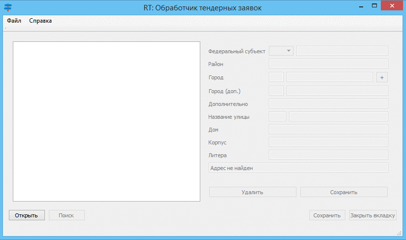

# AddressBID
Распознавание адресов (почтовых адресов, напр.: "г. Санкт-Петербург, Невский пр-кт, д. 116А"), записанных в любом формате, и поиск их в загруженной базе данных.
Для найденных адресов производится назначение STREET_ID и BUILD_ID взятых из базы. Для ненайденных имеется возможность внести правки и повторить поиск.
В основе лежат регулярные выражения (RegExp). База адресов хранится в БД SQLite.
Засчет использования индексации поиск среди 1 млн. записей происходит за считанные миллисекунды.
Пройден весь этап разработки ПО - от сбора требований до этапа внедрения в эксплуатацию.
Установочный файл программы доступен по адресу: <a href='http://bit.ly/AddressBID_setup'>bit.ly/AddressBID_setup</a>

Создано по заказу и при поддержке компании <a href='http://rt.ru'>АО Ростелеком</a> (2015-2016 гг.).

